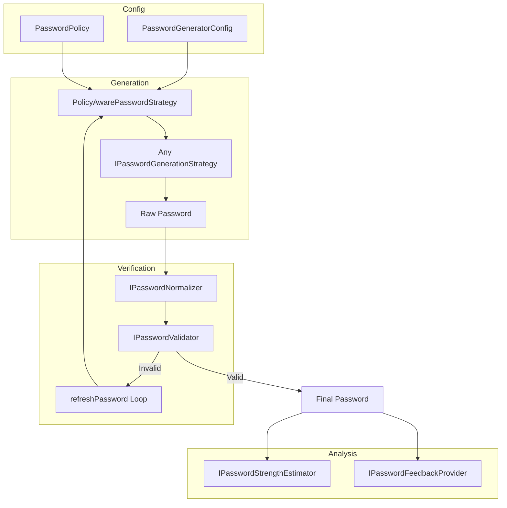

# Library Flow

This document reviews the library flow and explains how the pieces work together.

## Purpose and scope

- Explains how generation, validation, estimation, and feedback work end-to-end.
- Describes configuration options and extension points.

## Index

- [High-level flow](#high-level-flow)
- [Core pieces](#core-pieces)
- [Configuration details](#configuration-details)
- [Validation and estimation](#validation-and-estimation)
- [Feedback](#feedback)
- [Security](#security)
- [Localization and messages](#localization-and-messages)
- [Retry and errors](#retry-and-errors)
- [Customization guide](#customization-guide)

## High-level flow

## Core pieces

- **`PasswordGenerator`**: Central orchestrator for generation, validation, and estimation.
- **`PasswordGeneratorConfig`**: Immutable configuration (length, character sets, policy). Use the `PasswordGeneratorConfigBuilder` for fluent construction.
- **`PasswordPolicy`**: Declarative rules (min/max length, required types, strength thresholds). Use `PasswordPolicyBuilder` for fluent construction.
- **`CharacterSetProfile`**: Defines standard and non-ambiguous character sets. Override with a custom profile to change the character pool.
- **`PolicyAwarePasswordStrategy`**: Decorator that applies `PasswordPolicy` constraints before delegating to a base strategy.
- **`RandomPasswordStrategy`**: Default strategy — random characters from a character pool.
- **`PassphrasePasswordStrategy`**: Alternative strategy — random words from a wordlist joined by a separator.
- **`ConfigAwarePasswordValidator`**: Validates passwords against the current config and policy.
- **`NormalizedPasswordValidator`**: Wrapper that normalizes input before delegating to an inner validator.
- **`BlocklistPasswordValidator`**: Rejects passwords found in a blocklist.
- **`PasswordStrengthEstimator`**: Calculates pool-based entropy and maps it to `PasswordStrength` levels.
- **`PasswordFeedbackBuilder`**: Provides user-friendly suggestions and warnings.
- **`IPasswordNormalizer`**: Preprocesses passwords (e.g., trimming, NFC normalization) before validation or analysis.
- **`SensitivePassword`**: Extension type that wraps a raw password string and provides a `masked` property to prevent accidental plaintext exposure in logs or UI.

## Configuration details

- **`length`**: Target length (or word count for passphrases).
- **Character Toggles**: `useUpperCase`, `useLowerCase`, `useNumbers`, `useSpecialChars`.
- **`excludeAmbiguousChars`**: Automatically switches to character sets without visually similar characters (e.g., `0`, `O`, `l`, `I`).
- **`characterSetProfile`**: Allows overriding the actual characters used in each set.
- **`policy`**: A `PasswordPolicy` instance for strict requirement enforcement.
- **`maxGenerationAttempts`**: Guards against infinite loops if a configuration makes it impossible to satisfy a validator.

## Validation and estimation

The validation flow is "Config Aware" by default:
1. The password is **Normalized**.
2. **Policy Checks**: Length bounds and mandatory character types are verified.
3. **Strength Checks**: If a `strengthThreshold` or `scoreThreshold` is defined in the policy, the estimator is used to verify the password's entropy.

## Feedback

Feedback provides actionable intelligence:
- **`PasswordFeedbackContext`**: Captures the password, its normalized form, the configuration, and the estimated strength.
- **Contextual providers**: Can offer specific advice based on policy gaps (e.g., missing character types).

## Security

- **`SensitivePassword`**: Extension type that wraps a raw password string. Use `.masked` to display passwords safely in logs or UI. Note that `toString()` on Dart extension types returns the underlying value; always prefer `.masked`.
- **CSPRNG**: All randomness is sourced from `Random.secure()` (platform CSPRNG).
- **Max-length guard**: `RandomPasswordStrategy` enforces a maximum of 1024 characters to prevent excessive resource usage.

## Localization and messages

- **Source of truth**: `lib/l10n/messages.i18n.yaml` defines feedback and error strings.
- **Generated output**: `lib/l10n/messages.i18n.dart` is generated by the `i18n` builder and contains the `Messages` API.
- **Build config**: `build.yaml` restricts generation to `lib/l10n/**.i18n.yaml`.
- **Usage**: `Messages` is used by the feedback builder and by strategies that throw policy-related errors.

## Retry and errors

The `refreshPassword()` method implements a robust retry mechanism:
- It attempts to generate a password that satisfies the validator up to `maxGenerationAttempts`.
- If it fails, it throws a `PasswordGenerationException`, preventing the library from returning a password that doesn't meet the user's defined standards.

## Customization guide

- **Custom algorithms**: Implement `IPasswordGenerationStrategy`.
- **Custom strength logic**: Implement `IPasswordStrengthEstimator`.
- **Company policies**: Create a standard `PasswordPolicy` and reuse it.
- **Blocklist validation**: Use `BlocklistPasswordValidator` to reject weak or compromised passwords.
- **Normalization**: Inject a custom `IPasswordNormalizer` for NFC normalization, trimming, or confusable stripping.
- **Character sets**: Provide a custom `CharacterSetProfile` to control the exact characters used.
