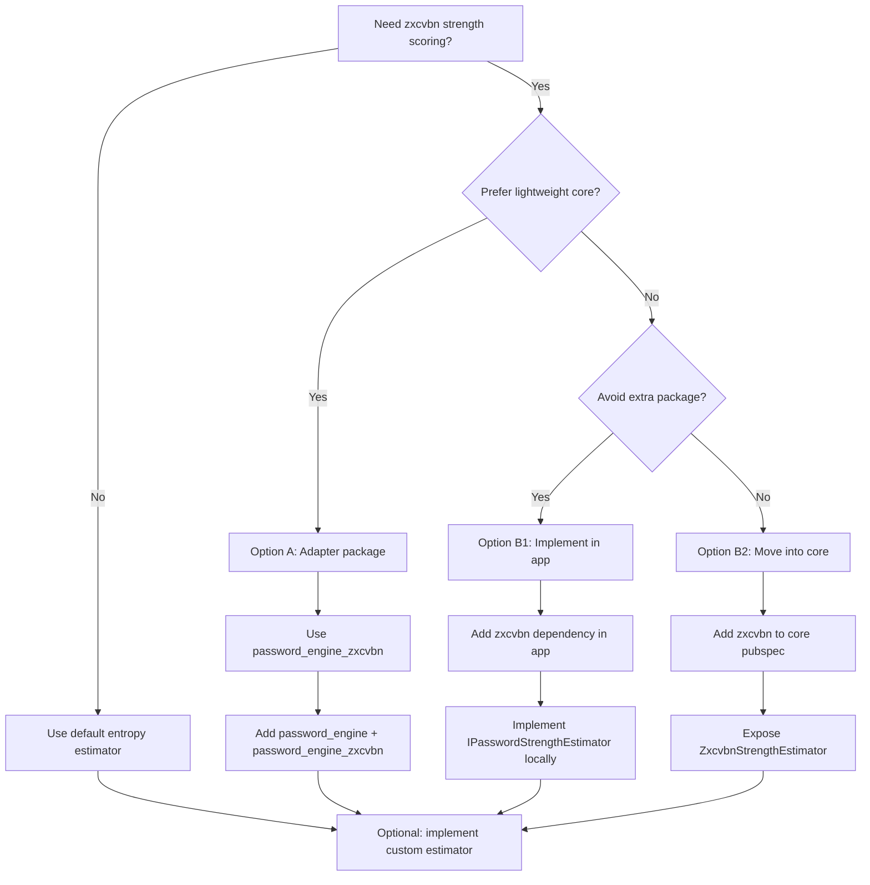

# Zxcvbn Integration Options

## Goal
Provide realistic password strength scoring while keeping the core library light and flexible.

Note: Regardless of which option you choose, users can always implement their own
`IPasswordStrengthEstimator` and inject it into `PasswordGenerator`.

## Shared Details (If You Use zxcvbn)

### Score Mapping
Map zxcvbn scores (0-4) to `PasswordStrength`:

- 0 -> `veryWeak`
- 1 -> `weak`
- 2 -> `medium`
- 3 -> `strong`
- 4 -> `veryStrong`

### Suggested API Shape
Expose a single estimator class with optional inputs:

- `ZxcvbnStrengthEstimator` implements `IPasswordStrengthEstimator`.
- Optional `userInputs` list to penalize known words or user data.

### Tests (Recommended)
- Verify score-to-enum mapping (0-4).
- Validate typical weak vs strong passwords.
- If `userInputs` is supported, check that it reduces score.

## Option A: Keep the Adapter Package (Current Design)
This keeps `password_engine` dependency-free and lets users opt in to zxcvbn when they want it.

### Steps
1. Keep `password_engine_zxcvbn` as a separate package.
2. Use `password_engine` as the API contract and `zxcvbn` as an optional runtime dependency.
3. Expose a single estimator class and keep score mapping internal to the adapter.
4. Document usage in the adapter README and reference it from the core README.

### Changes Required
- Adapter package
  - Keep `password_engine_zxcvbn` dependency on `password_engine` and `zxcvbn`.
  - Maintain estimator implementation and tests.
- Core package
  - Only documentation changes to show opt-in usage.

### Pros
- No extra dependency or code size for core users.
- Clear separation of concerns.
- Independent versioning and release cadence.

### Cons
- Additional package to maintain and publish.
- Users must add a second dependency for zxcvbn scoring.

## Option B: No Adapter Package
This means not publishing a separate wrapper package. There are two sub-approaches:

### B1: Use zxcvbn directly in the app (no wrapper package)
Consumers add `zxcvbn` and implement the estimator in their own project.

#### Steps
1. In the app, add `zxcvbn` dependency.
2. Implement `IPasswordStrengthEstimator` locally.
3. Inject the estimator into `PasswordGenerator`.
4. Optionally copy the mapping logic from the adapter.

#### Changes Required
- No changes to `password_engine` package code.
- Core docs should include a short example for a custom estimator using zxcvbn.

#### Pros
- No extra package to publish or maintain.
- Users have full control over configuration.

#### Cons
- Repeated boilerplate across projects.
- No shared tests or canonical adapter logic.

### B2: Move zxcvbn into the core package
Add `zxcvbn` as a direct dependency and ship the estimator inside `password_engine`.

#### Steps
1. Add `zxcvbn` dependency to core `pubspec.yaml`.
2. Add `ZxcvbnStrengthEstimator` to core library.
3. Export it from the public API.
4. Add tests and update documentation.

#### Changes Required
- Core package code and dependencies.
- Increase package size and dependency surface for all users.

#### Pros
- Simplest usage for consumers.
- One package to install.

#### Cons
- All users pay the dependency and size cost.
- Harder to keep core minimal.

## Recommendation Guidance
- If you want a lightweight core with opt-in realism: Option A.
- If you want no extra package to publish: Option B1.
- If you want the simplest consumer experience and accept extra deps: Option B2.

## Flow Diagram

