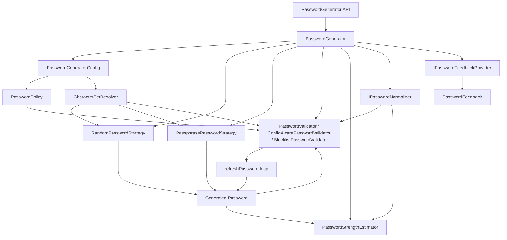

# Library Flow

This document reviews the library flow and explains how the pieces work together.

## Purpose and scope

- Explains how generation, validation, estimation, and feedback work end-to-end.
- Describes configuration options and extension points.
- Focuses on the library internals under lib (not installation or platform setup).

For installation and basic usage, see the project README.

## Related docs

- [README](../README.md)

## Index

- [Purpose and scope](#purpose-and-scope)
- [Related docs](#related-docs)
- [Quick start](#quick-start)
- [High-level flow](#high-level-flow)
- [Core pieces](#core-pieces)
- [Configuration details](#configuration-details)
- [Validation and estimation](#validation-and-estimation)
- [Retry and errors](#retry-and-errors)
- [End-to-end behavior summary](#end-to-end-behavior-summary)
- [Customization guide](#customization-guide)

## Quick start

```dart
final generator = PasswordGenerator();
final password = generator.generatePassword();
final strength = generator.estimateStrength(password);
final feedback = generator.estimateFeedback(password);
```

If you want to change the rules, update the config:

```dart
generator.updateConfig(
  const PasswordGeneratorConfig(
    length: 16,
    useUpperCase: true,
    useLowerCase: true,
    useNumbers: true,
    useSpecialChars: false,
  ),
);
```

If you need policy rules (min/max length, required types, allow spaces), pass a `PasswordPolicy` in the config.

## High-level flow



Flow in words:

1. You call `PasswordGenerator`.
2. It reads `PasswordGeneratorConfig` (defaults + your overrides).
3. A strategy creates a candidate password.
4. The normalizer can adjust the password (if provided).
5. A validator decides if it is strong enough.
6. A strength estimator scores it.
7. A feedback provider can turn that score into warnings and suggestions.

## Core pieces

- `PasswordGenerator`: the main class you use. It connects the strategy, validator, estimator, normalizer, and feedback provider.
- `PasswordGeneratorConfig`: your settings (length, allowed character types, ambiguity rules, policy, retry limits).
- `RandomPasswordStrategy`: default strategy for classic random passwords.
- `PassphrasePasswordStrategy`: word-based passphrases (length = word count).
- `PasswordValidator`: fixed default rules.
- `ConfigAwarePasswordValidator`: rules based on your config and policy.
- `BlocklistPasswordValidator`: rejects known bad passwords.
- `PasswordStrengthEstimator`: estimates strength based on the character pool and length.
- `IPasswordNormalizer`: optional hook to normalize input before validation/estimation.
- `IPasswordFeedbackProvider`: optional hook to generate warnings and suggestions.
- `PasswordPolicy`: optional rules like min/max length or required types.
- `PasswordFeedback`: warnings and suggestions returned to the user.
- `PasswordStrength`: strength buckets.
- `CharacterSetProfile`: the actual character sets used.
- `CharacterSetResolver`: shared helper to figure out which character sets are enabled.

## Configuration details

- `length`: total password length, or word count for passphrases.
- `useUpperCase`, `useLowerCase`, `useNumbers`, `useSpecialChars`: toggle each character set.
- `excludeAmbiguousChars`: uses non-ambiguous character sets when true.
- `characterSetProfile`: custom characters for each set (for example, limit specials to a safe subset).
- `policy`: optional `PasswordPolicy` that overrides min/max length and required character types.
- `maxGenerationAttempts`: how many times `refreshPassword()` will retry before throwing.

## Validation and estimation

- `PasswordValidator` is fixed-rule validation (minimum length and all required types).
- `ConfigAwarePasswordValidator` uses your config and optional policy; it only requires the types you enable.
- `BlocklistPasswordValidator` wraps another validator and rejects passwords from a supplied blocklist.
- `PasswordStrengthEstimator` uses entropy: it checks which sets appear in the password and calculates a score from the configured pool size and length.

## Retry and errors

- `refreshPassword()` keeps generating until validation succeeds or the max attempt count is hit.
- If retries are exhausted, a `PasswordGenerationException` is thrown with the failure code and max attempts.

## End-to-end behavior summary

- `PasswordGenerator` resolves a `PasswordGeneratorConfig` from defaults or user settings.
- The chosen strategy validates config and generates a password.
- `refreshPassword()` uses the validator to enforce strength and may retry.
- The estimator provides a strength classification; `estimateFeedback()` uses the feedback provider to return user-facing feedback.

## Customization guide

- Want passphrases? Use `PassphrasePasswordStrategy` and set `length` to the number of words.
- Want classic random passwords? Use the default `RandomPasswordStrategy`.
- Want strict policy rules? Add a `PasswordPolicy` to the config.
- Want blocklist checks? Wrap your validator with `BlocklistPasswordValidator`.
- Want custom warnings or tips? Provide your own `IPasswordFeedbackProvider`.
- Want Unicode normalization or trimming? Provide your own `IPasswordNormalizer`.
