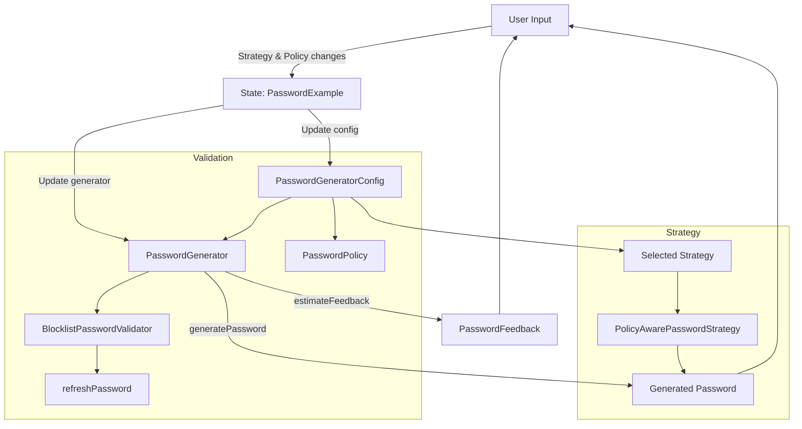
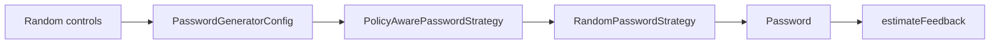
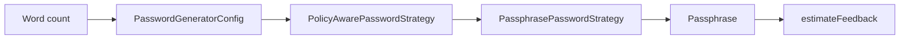
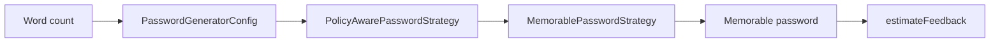
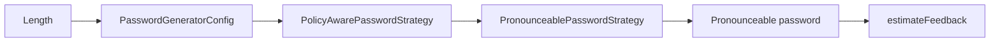
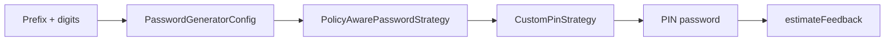
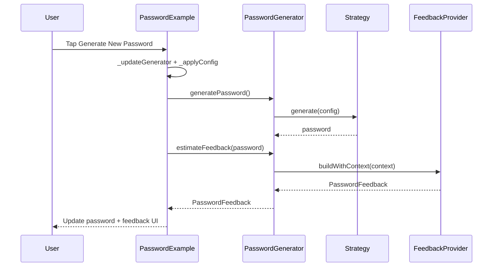
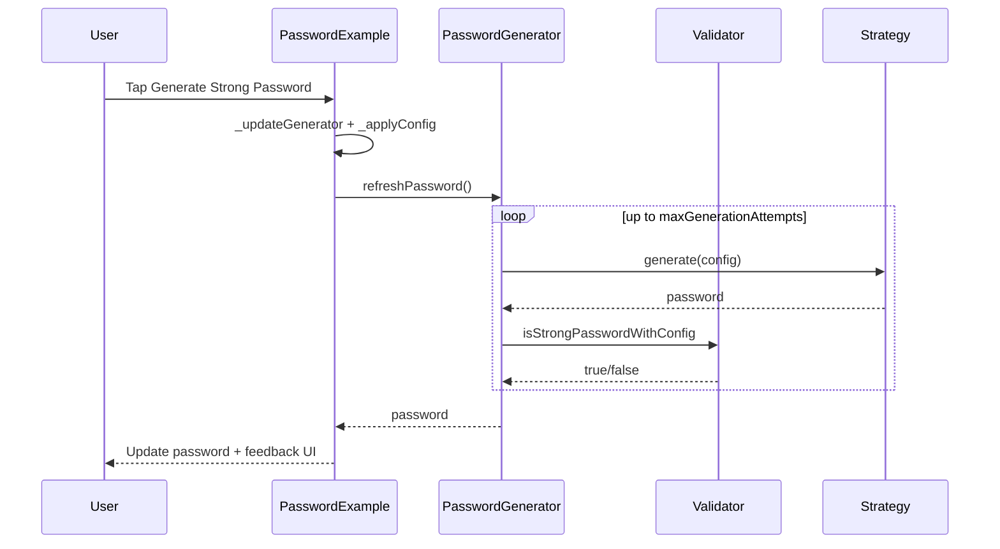

# Example App Flow Review

This document explains how each section in the example UI works and how data flows between generation, validation, and feedback.

## Index

- [High-level flow](#high-level-flow)
- [Quick start reading guide](#quick-start-reading-guide)
- [Key concepts](#key-concepts)
- [Diagram legend](#diagram-legend)
- [Strategy flows (detailed)](#strategy-flows-detailed)
- [Random strategy](#random-strategy)
- [Passphrase strategy](#passphrase-strategy)
- [Memorable strategy](#memorable-strategy)
- [Pronounceable strategy](#pronounceable-strategy)
- [Custom PIN strategy](#custom-pin-strategy)
- [State and data flow details](#state-and-data-flow-details)
- [Generator wiring](#generator-wiring)
- [Config assembly](#config-assembly)
- [Feedback building](#feedback-building)
- [Sequence diagrams](#sequence-diagrams)
- [Generate new password](#generate-new-password)
- [Generate strong password](#generate-strong-password)

## Quick start reading guide

If this is your first read, start here:

1. Scan the **High-level flow** diagram to see the full lifecycle.
2. Read **Key concepts** to learn the roles of strategy, policy, validator, estimator, and feedback.
3. Jump to the **strategy flow** that matches your feature focus.
4. Use **Sequence diagrams** to understand the runtime order of calls.

## Key concepts

- **Strategy:** The algorithm that produces the password (random, passphrase, etc.).
- **Policy:** Declarative rules (length and required types) that can override config.
- **Validator:** Checks whether a generated password meets config and policy rules.
- **Estimator:** Scores strength (entropy or zxcvbn).
- **Feedback:** Human-readable warnings and suggestions derived from the estimator and policy.

## Diagram legend

- **UI:** User-driven inputs or taps.
- **Config:** The assembled `PasswordGeneratorConfig` passed into generation.
- **Policy-aware:** The wrapper that adjusts config based on policy.
- **Strategy:** The concrete generator that outputs the password.
- **Feedback:** The step that turns strength into user-facing guidance.

## High-level flow

## Strategy flows (detailed)

Each strategy uses the same core steps, but the strategy-specific generation logic and validation constraints differ. Policy-aware generation can adjust the effective length and required character types before a strategy runs.

### Random strategy

**Inputs used**

- Length slider.
- Character type toggles (upper/lower/number/special).
- Exclude ambiguous toggle.
- Character set profile (and optional spaces if policy allows).

**Generation steps**

1. UI updates config with the selected length and toggles.
2. `PolicyAwarePasswordStrategy` may increase length to meet policy min or clamp to policy max.
3. Random generation uses the resolved character sets from the profile and toggles.
4. Password is returned and fed into `estimateFeedback()`.

**Validation behavior**

- `refreshPassword()` retries until `ConfigAwarePasswordValidator` passes.
- Policy can require specific types even if toggles are off (policy overrides).
- Blocklist validator rejects known common passwords when enabled.

### Passphrase strategy

**Inputs used**

- Word count slider.
- Wordlist and separator (fixed in the example).
- Policy min/max length may affect word count.

**Generation steps**

1. UI sets config length as word count.
2. Policy-aware wrapper adjusts word count based on min/max rules.
3. Strategy randomly selects words and joins them with the separator.
4. Feedback is built and can include policy length warnings.

**Validation behavior**

- Length checks apply to final passphrase length.
- If policy requires special characters, allowing spaces can satisfy it when enabled.
- Blocklist can reject passphrases if the normalized value appears in the list.

### Memorable strategy

**Inputs used**

- Word count slider.
- Optional capitalization in the strategy instance.

**Generation steps**

1. UI sets config length as word count.
2. Policy-aware wrapper adjusts word count if needed.
3. Strategy selects words and joins with the configured separator.
4. Feedback reflects policy rules and estimator strength.

**Validation behavior**

- Strategy enforces a minimum of 4 words.
- Policy min/max can further constrain word count.
- Blocklist applies to the final composed string.

### Pronounceable strategy

**Inputs used**

- Length slider.

**Generation steps**

1. UI sets config length.
2. Policy-aware wrapper adjusts length for min/max policy rules.
3. Strategy alternates consonants and vowels to build a string.
4. Feedback and strength are derived from the final password.

**Validation behavior**

- Strategy enforces minimum length of 4.
- Policy can require numbers or special characters, which may not be produced by this strategy and will cause validation to fail on refresh.

### Custom PIN strategy

**Inputs used**

- Prefix text field (stored in config extra).
- Length slider (digit count).

**Generation steps**

1. UI stores prefix in `extra` and length as digit count.
2. Policy-aware wrapper adjusts digit count for min/max policy rules.
3. Strategy builds `PREFIX-` + random digits.
4. Feedback includes policy violations when present.

**Validation behavior**

- Strategy enforces minimum length of 4 digits.
- Policy-required character types can conflict with numeric-only output, which can cause `refreshPassword()` to retry until it exhausts attempts.

## State and data flow details

### Generator wiring

- `_updateGenerator()` selects:
  - Strategy: the currently selected `IPasswordGenerationStrategy`.
  - Validator: optional `BlocklistPasswordValidator` when enabled.
  - Estimator: optional zxcvbn when toggled.
  - Feedback provider: contextual provider to show policy and blocklist warnings.

### Config assembly

- `_applyConfig()` produces `PasswordGeneratorConfig` with:
  - Length and character toggles from the UI.
  - Character profile and optional space support.
  - Policy settings via `_buildPolicy()`.
  - Extra map for strategy-specific needs (e.g., PIN prefix).

### Feedback building

- `estimateFeedback()` returns a `PasswordFeedback` object.
- The contextual provider enriches feedback with:
  - Policy violations (min/max, required types).
  - Blocklist warnings when enabled.

## Sequence diagrams

### Generate new password

### Generate strong password

